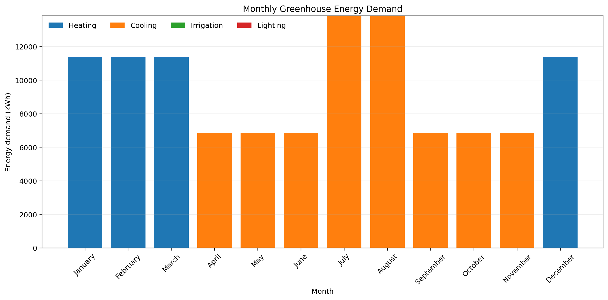
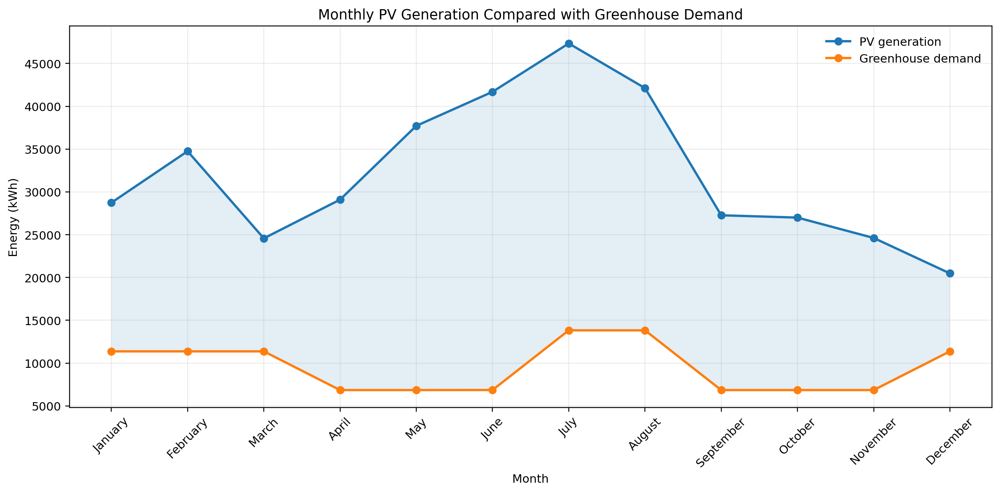
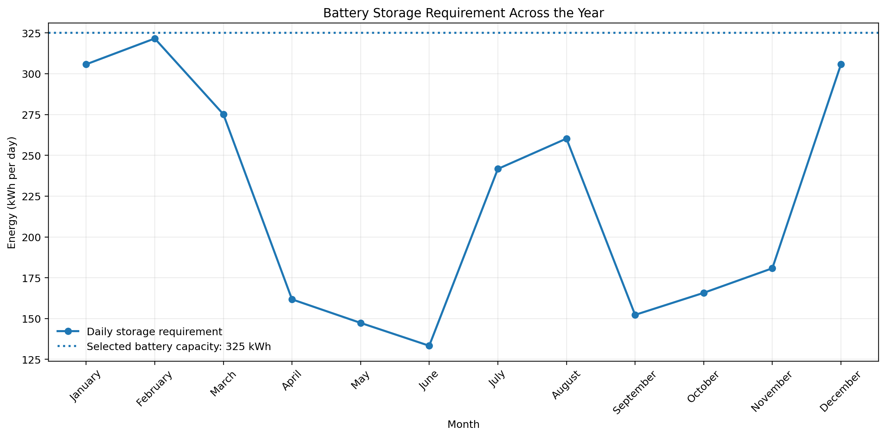
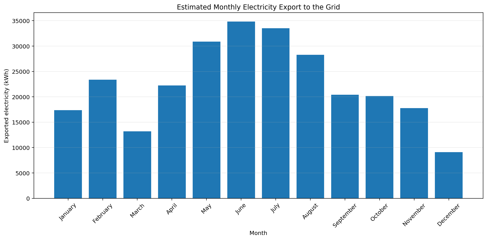
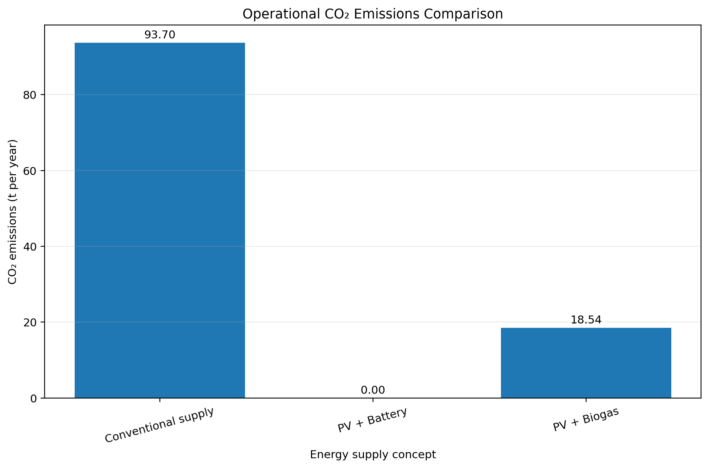
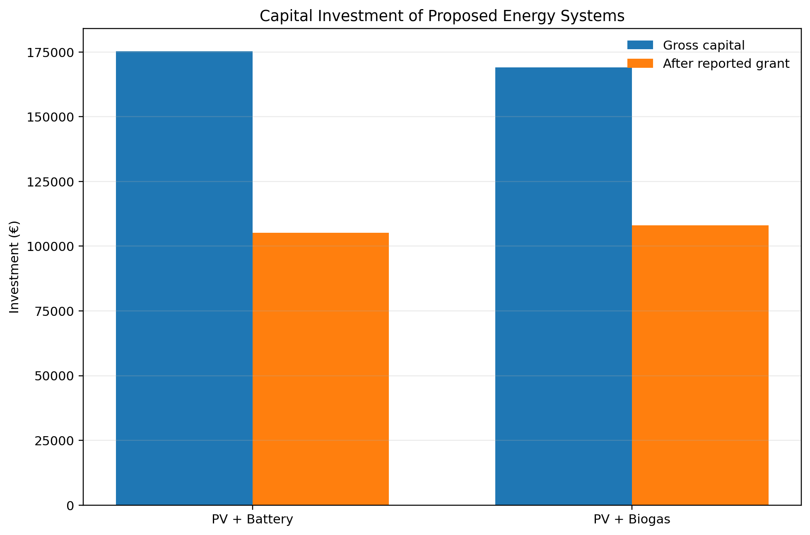
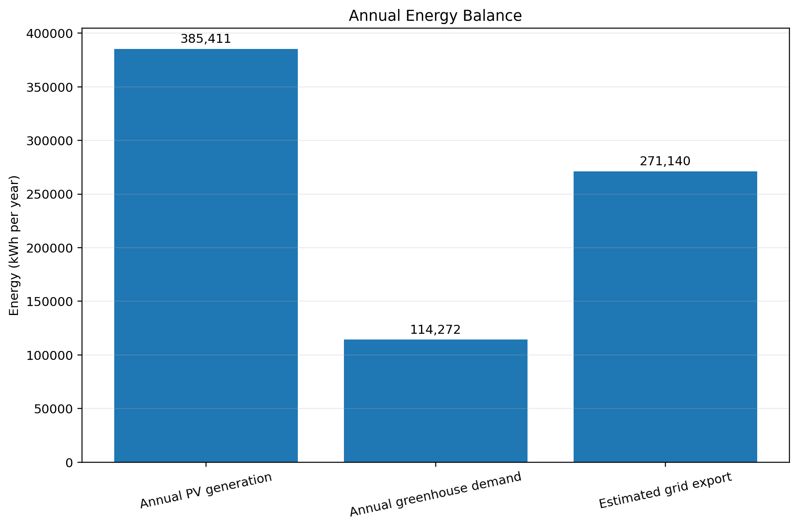

# Sustainable Greenhouse Energy System Design

**Techno economic assessment and Python visualization for a 1,000 m² cut rose greenhouse in Sicily, Italy**

This repository presents an academic energy systems project focused on reducing the energy and carbon footprint of greenhouse flower cultivation. The analysis compares two renewable supply concepts:

1. Photovoltaics with LiFePO4 battery storage
2. Photovoltaics with a biogas generator

The original project evaluated climate conditions, greenhouse energy demand, photovoltaic generation, battery sizing, biogas requirements, economics and CO₂ emissions. This GitHub version reorganizes the reported calculations into reproducible Python datasets and clear engineering visualizations.

## Project at a glance

| Parameter | Reported value |
| --- | ---: |
| Greenhouse area | 1,000 m² |
| Working cultivation area | 700 m² |
| Annual energy demand used in the monthly balance | 114,271.55 kWh |
| Installed PV capacity | 187 kW |
| Annual PV generation | 385,411.49 kWh |
| Selected battery capacity | 325 kWh |
| Conventional operational CO₂ emissions | 93.7 t per year |
| PV plus battery operational CO₂ emissions | 0 t per year |
| PV plus biogas operational CO₂ emissions | 18.54 t per year |

## Engineering workflow

```text
Sicily climate
      |
      v
Greenhouse demand model
      |
      +--------------------+
      |                    |
      v                    v
PV + Battery          PV + Biogas
      |                    |
      v                    v
Energy balance       Energy balance
      |                    |
      +----------+---------+
                 |
                 v
       Economics and CO2
```

## Visual analysis

### Monthly greenhouse demand

Heating dominates the winter months, while cooling becomes the major demand during summer.



### PV generation compared with demand

The reported PV system produces substantially more electricity than the monthly greenhouse demand, creating export potential.



### Battery storage requirement

The calculated maximum daily storage requirement occurs in February and motivated the reported 325 kWh LiFePO4 battery selection.



### Grid export potential

Excess PV electricity was estimated on a monthly basis after meeting direct demand and storage requirements.



### Operational emissions

The renewable concepts substantially reduce reported operational CO₂ emissions compared with the conventional supply case.



### Capital investment

The analysis compares the two proposed renewable concepts before and after the reported government support.



### Annual energy balance



## Repository structure

```text
greenhouse_energy_github/
│
├── data/
│   ├── monthly_energy_demand.csv
│   ├── monthly_pv_generation.csv
│   ├── battery_storage_and_export.csv
│   ├── system_comparison.csv
│   └── annual_energy_balance.csv
│
├── figures/
│   ├── 01_monthly_energy_demand.png
│   ├── 02_pv_generation_vs_demand.png
│   ├── 03_battery_storage_requirement.png
│   ├── 04_monthly_grid_export.png
│   ├── 05_operational_emissions_comparison.png
│   ├── 06_capital_investment_comparison.png
│   └── 07_annual_energy_balance.png
│
├── src/
│   └── visualize.py
│
├── requirements.txt
└── README.md
```

## Run the visualization

```bash
pip install -r requirements.txt
python src/visualize.py
```

## Main technical topics

Python data analysis  
Energy demand modelling  
Photovoltaic system sizing  
Battery storage sizing  
Biogas energy systems  
Techno economic assessment  
CO₂ emissions comparison  
Greenhouse energy systems

## Data note

The CSV files reproduce values reported in the original academic project tables. The source report contains a few inconsistent total energy demand figures in later sections. For reproducibility, this repository uses the monthly energy balance total of **114,271.55 kWh per year** as its main demand basis rather than silently mixing inconsistent totals.

## Academic context

This work originated as a group project in the Renewable Thermal Power Plants course at Friedrich Alexander University Erlangen Nürnberg. The repository is a portfolio presentation of the engineering analysis and Python based visualization.

## Author

**Nadeem Raza**  
Chemical Engineer and M.Sc. Clean Energy Processes student  
[LinkedIn](https://www.linkedin.com/in/nadeem-raza-255902208/)
